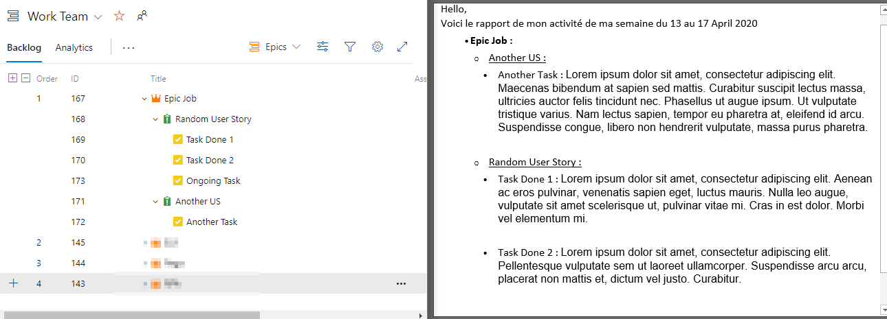

The goal of this script is to create an email based on the work done during the week using my personnal Azure devops backlog.

It will take the date of the current week to adapt the introduction.
Then it will connect to the Azure devops backlog to get all task done (closed) during the week.
It will recreate the hierarchy of the Backlog (Epic -> User Story -> Task ) and will take the description of each task in an html format.

## How to use it
Fill the variable related to your Azure connection:
-  $Azure_Organisation = "****"
- $Azure_Project = "****"
- $Azure_Username = "****"
- $Azure_Password = "****"
- $Azure_Workitem_IDs = x,y,z

The Workitem ID are the ID of the Epic in the backlog, the script will find automatically the related children.

Fill Also the information about your stmp server and the recipient of the email:
- $To = "*****"
- $SMTPServer =  "****"
- $SMTPPort = 25 

## To do 
- put all variable in a config file.

## Notes:

- I don't use the Azure devops powershell module because i wasn't admin of the machine when I developped this.
-  I usually sent this report to myself just to correct or add things if I need to. Then I forward it.